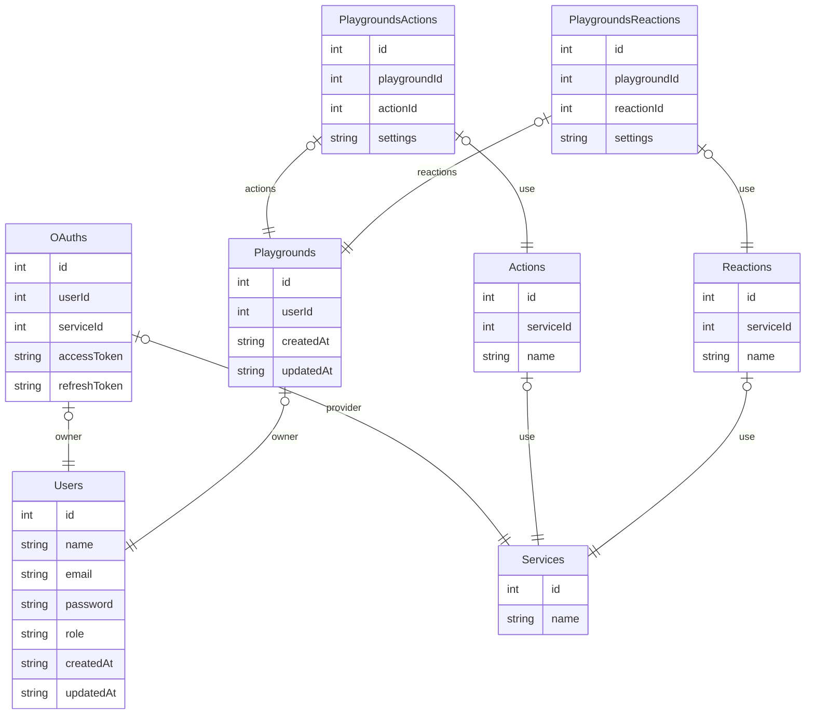

# TriggerMeNot Server

## Tech Stack

Only Open Source and Free Software technologies are used in this project.

### API

[](https://www.typescriptlang.org/)

- Advantages of modern JavaScript features
- Static type checking
- Most used language for web development

[](https://deno.com/)

- Good performance [Benchmarks](https://deno.com/benchmarks)
- Secure by default
- Built-in TypeScript support
- Format / linting and testing tools
- Built with web standards

Comparison with Node.js and Bun:

| Deno                        | Node.js                      | Bun                          |
| --------------------------- | ---------------------------- | ---------------------------- |
| Secure by default           | Insecure by default          | Secure by default            |
| Built-in TypeScript support | Requires TypeScript compiler | Requires TypeScript compiler |
| Built-in formatting         | Requires external tools      | Requires external tools      |
| Built-in linting            | Requires external tools      | Requires external tools      |
| Built-in testing            | Requires external tools      | Requires external tools      |
| Built with web standards    | Not built with web standards | Not built with web standards |

[](https://hono.dev/)

- Fast and lightweight web framework
  [Benchmarks](https://hono.dev/docs/concepts/benchmarks)
- Easy to use
- Middleware support
- Build with web standards

Comparison with FastAPI and NestJS:

| Hono                     | FastAPI                      | NestJS                       |
| ------------------------ | ---------------------------- | ---------------------------- |
| TypeScript (any Runtime) | Python                       | TypeScript (Node.js Runtime) |
| Fast and lightweight     | Fast and lightweight         | Fast and lightweight         |
| Easy to use              | Easy to use                  | Not easy but not hard to use |
| Advanced Middleware      | Limited Middleware           | Advanced Middleware          |
| Own library              | Own library                  | Express or Fastify           |
| Built with web standards | Not built with web standards | Not built with web standards |

[](https://orm.drizzle.team/)

- Fast and lightweight ORM [Benchmarks](https://orm.drizzle.team/benchmarks)
- Easy to use
- Built for SQL databases

Comparison with Prisma:

| Drizzle          | Prisma                  |
| ---------------- | ----------------------- |
| Best performance | Good performance        |
| Easy to use      | Easy to use             |
| Built for SQL    | Built for SQL and NoSQL |

### Database

[](https://www.postgresql.org/)

- Powerful and open-source relational database
- Supports JSON and JSONB data types

Comparison with MySQL, SQLite, and MongoDB:

| PostgreSQL | MySQL      | SQLite      | MongoDB  |
| ---------- | ---------- | ----------- | -------- |
| Powerful   | Popular    | Lightweight | Flexible |
| SQL        | SQL        | SQL         | NoSQL    |
| Relational | Relational | Relational  | Document |

### Deployment

[](https://www.docker.com/)

- Containerization
- Easy to deploy
- Works on any platform

## Development

```bash
cp .env.dev.example .env.dev
```

Set the environment variables in the `.env.dev` file.

```bash
docker compose -f compose.yml up -d
```

```bash
deno install --allow-scripts=npm:bcrypt@5.1.1
```

```bash
deno -A npm:drizzle-kit generate
```

```bash
deno -A --env-file=.env.dev npm:drizzle-kit migrate
```

```bash
deno task dev
```

## Production

```bash
cp .env.prod.example .env.prod
```

Set the environment variables in the `.env.prod` file.

```bash
docker compose -f compose.prod.yml up -d
```

## Routes Documentation

Go on running server and open the `/doc` or `/reference` route to see Routes
Documentation.

## Database


